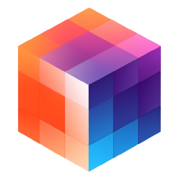
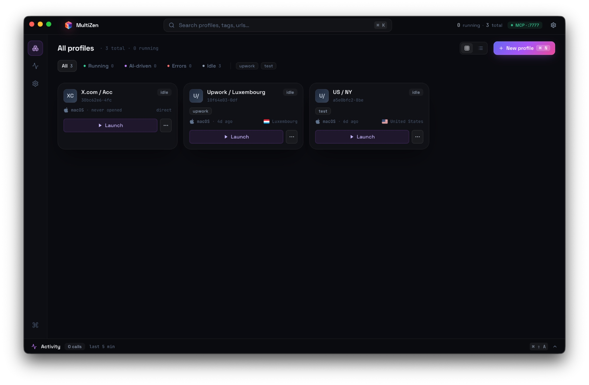
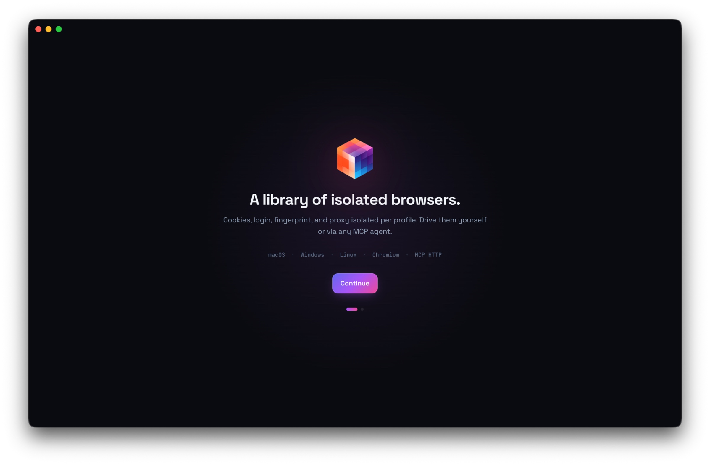

<div align="center">
  

  <h1>MultiZen</h1>

  <p><strong>A browser library for AI agents and human operators.</strong></p>

  <p>
    Local Chromium profiles with their own cookies, fingerprint, and proxy.<br/>
    Drive them through MCP from Cursor, Claude Desktop, or any MCP client.<br/>
    Step in manually whenever the agent hits a CAPTCHA or 2FA prompt.
  </p>

  <p>
    <a href="https://github.com/multizenteam/multizen-browser/releases/latest"></a>
    <a href="https://github.com/multizenteam/multizen-browser/blob/master/LICENSE"></a>
    <a href="https://github.com/multizenteam/multizen-browser/actions/workflows/release.yml"></a>
    <a href="https://github.com/multizenteam/multizen-browser/releases"></a>
    <a href="https://github.com/multizenteam/multizen-browser/stargazers"></a>
    <a href="https://discord.gg/pd6MhzPbJ3"></a>
  </p>

  <p>
    <a href="https://getmultizen.com"><strong>getmultizen.com</strong></a>
    &nbsp;·&nbsp;
    <a href="https://github.com/multizenteam/multizen-browser/releases/latest">Download</a>
    &nbsp;·&nbsp;
    <a href="https://discord.gg/pd6MhzPbJ3">Discord</a>
  </p>

  <br/>

  

  <br/><br/>
</div>

## What it is

MultiZen is a desktop app that runs a library of isolated Chromium browser profiles. Each profile has its own cookies, login state, fingerprint, and proxy. A local MCP server on `localhost:7777` exposes browser-drive tools (navigate, click, type, extract, screenshot) to any MCP client.

The result: your AI agent in Cursor or Claude Desktop can complete real authenticated workflows. When it hits a 2FA prompt or CAPTCHA, you step in through the same Chromium window. When you are done, the agent picks up where it left off. Cookies and session state survive between launches.

## Install

### macOS

The cleanest path. Homebrew handles the Gatekeeper quarantine for you:

```sh
brew tap multizenteam/multizen
brew install --cask multizen
```

Or grab the DMG straight from the [releases page](https://github.com/multizenteam/multizen-browser/releases/latest) and run this once after install to bypass the unsigned-app warning:

```sh
xattr -cr /Applications/MultiZen.app
```

### Linux

```sh
curl -LO https://github.com/multizenteam/multizen-browser/releases/latest/download/MultiZen-linux-x86_64.AppImage
chmod +x MultiZen-linux-x86_64.AppImage
./MultiZen-linux-x86_64.AppImage
```

Some distros need `libfuse2` (`apt install libfuse2t64` on Ubuntu 24.04+). If Chromium's sandbox refuses to start, add `--no-sandbox`.

### Windows

Download [MultiZen-win-x64.exe](https://github.com/multizenteam/multizen-browser/releases/latest/download/MultiZen-win-x64.exe). SmartScreen will warn the installer is not signed by an EV cert (we are working on it). Click **More info**, then **Run anyway**.

### One-liner installer

For macOS and Linux:

```sh
curl -sSL https://getmultizen.com/install.sh | bash
```

## How it works

```
+----------------------+         +-----------------------+
|  Cursor / Claude     |  MCP    |  MultiZen Desktop App |
|  Desktop / Cline     | <-----> |  localhost:7777       |
+----------------------+         +-----------+-----------+
                                             |
                                             | spawn / drive (CDP)
                                             v
                              +--------------+--------------+
                              |  Profile A  |  Profile B  | ...
                              |  cookies    |  cookies    |
                              |  proxy LU   |  proxy US   |
                              |  Win 145    |  macOS 145  |
                              +-------------+--------------+
                                            |
                                            v
                                  patched Chromium binary
                                  (canvas, WebGL, audio,
                                   font, WebRTC fingerprints
                                   spoofed at C++ level)
```

Each profile is a real Chromium window with persistent state on disk. The MCP server speaks the standard Anthropic Model Context Protocol over HTTP and SSE so it works with any client. Browser-drive tools call into Chrome DevTools Protocol under the hood.

## Features

|  | What it does |
| --- | --- |
| **MCP server** | Native localhost endpoint. Works with Cursor, Claude Desktop, Cline, Continue, anything else that speaks MCP. |
| **Anti-detect Chromium** | Source-patched browser engine (CloakBrowser). Canvas, WebGL, audio, fonts, WebRTC IP all spoofed at C++ level instead of JS injection. |
| **Persistent state** | Cookies, login, IndexedDB, localStorage stay per-profile across launches and across AI sessions. |
| **Human handoff** | AI gets stuck on 2FA or CAPTCHA, you take over in the same Chromium window, the agent continues when you are done. |
| **Cross-platform persona** | Run a Windows persona on a Mac host (or vice versa). C++ patches keep the fingerprint coherent across V8, Blink, and CSS feature signatures. |
| **Proxy + persona alignment** | Per-profile HTTP or SOCKS5 proxy with a local SOCKS5 bridge so DNS resolution stays remote. Auto-aligns timezone, locale, and `navigator.geolocation` to the proxy egress IP. |
| **Self-hosted** | Profiles live on your disk in plain SQLite plus Chromium user-data-dir format. No account, no license server, no telemetry. |
| **Open source** | MIT for the entire app, MCP server, and CDP driver. Patched Chromium engine is also open source. |

## Onboarding

<div align="center">
  
</div>

## Connect to Cursor or Claude Desktop

After installing, the MCP server starts on `localhost:7777`. Add it to your client config.

**Cursor** (`~/.cursor/mcp.json`):

```json
{
  "mcpServers": {
    "multizen": {
      "url": "http://localhost:7777/sse"
    }
  }
}
```

**Claude Desktop** (`~/Library/Application Support/Claude/claude_desktop_config.json` on macOS):

```json
{
  "mcpServers": {
    "multizen": {
      "url": "http://localhost:7777/sse"
    }
  }
}
```

Restart your client. The agent now has tools: `list_profiles`, `create_profile`, `update_profile`, `delete_profile`, `launch_profile`, `close_profile`, `navigate`, `click`, `type`, `extract`, `screenshot`, `list_fingerprint_options`. Profile management is full CRUD: `create_profile` / `update_profile` accept an optional `proxy` and high-level `fingerprint` (device, locale, timezone, screen), and `list_fingerprint_options` enumerates the valid device families and locale groups.

## Honest limits

Building trust by saying what is not yet done.

- **TLS fingerprint** is not spoofed yet. The most aggressive bot stacks (some Cloudflare Enterprise setups, DataDome) fingerprint JA3 or JA4 at the TLS layer and will catch us. On the roadmap.
- **Code signing**: macOS builds are ad-hoc signed (no Apple Developer ID), Windows installer is unsigned (no EV cert). Both raise warnings on first launch. The Homebrew install path bypasses this on macOS. SignPath OSS application is in flight for Windows.
- **Behavioral analysis** is not handled. DataDome and similar look at mouse paths, timing, and scroll patterns. The agent moves linearly through the DOM, which is detectable.
- **High parallelism is not the target**. Roughly 30 to 50 profiles per machine before the resource ceiling. For 500 concurrent browsers, use Browserbase or Hyperbrowser instead.
- **Anti-detect score** on fingerprint-scan.com is around 65/100 on a residential proxy. Roughly the CloakBrowser ceiling without our own custom patches.

## Stack

| Layer | Tech |
| --- | --- |
| Desktop shell | Electron 33 |
| Renderer | React 19, Tailwind v4, TypeScript strict |
| Main process | TypeScript ESM, electron-vite, native MCP SDK |
| MCP server | `@modelcontextprotocol/sdk` over HTTP and SSE |
| Profile storage | better-sqlite3 with idempotent migrations |
| Browser driver | chrome-remote-interface over CDP |
| Browser engine | CloakBrowser (open-source patched Chromium) |
| Build | Yarn 4 workspaces, electron-vite, electron-builder |
| CI | GitHub Actions matrix on macOS, Windows, Linux |

## Develop

```sh
git clone https://github.com/multizenteam/multizen-browser
cd multizen-browser
yarn install
yarn dev            # launch the desktop app in dev mode
yarn mcp:dev        # run the MCP server standalone for testing
yarn typecheck      # strict TS across all workspaces
yarn build          # full release build (mac/win/linux per OS)
```

Requires Node 22+ and Yarn 4 (via Corepack).

## Repo layout

```
apps/
  desktop/                Electron + React + Tailwind GUI + main process
packages/
  mcp-server/             MCP server exposing the browser-drive tools
  cdp-driver/             Thin wrapper around chrome-remote-interface
  profile-manager/        SQLite profile CRUD + encrypted local storage
  settings-store/         App-level settings persistence
  types/                  Shared TypeScript types
.github/
  workflows/release.yml   Matrix build, tag-triggered
```

## Roadmap

Things landing in upcoming releases.

- **multizen-pro patched Chromium**: TLS JA3/JA4 spoof, HTTP/2 SETTINGS fingerprint, native Sec-CH-UA-* overrides. Bumps the anti-detect ceiling well past 90/100 on fingerprint-scan.
- **Behavioral injection**: humanized mouse paths, keystroke timing, scroll jitter applied at the CDP input layer.
- **Per-profile cloud sync** (opt-in, end-to-end encrypted): so the same profile follows you across laptops.
- **Team workspaces**: shared profile pool with audit log.
- **Code signing**: Apple Developer ID, EV cert for Windows once SignPath OSS approves.

## Why MultiZen vs the alternatives

| | MultiZen | Browserbase / Hyperbrowser | GoLogin / AdsPower / Multilogin |
| --- | :---: | :---: | :---: |
| Native MCP server | yes | yes | profile CRUD only |
| Drives the browser through MCP | yes | yes | no |
| Anti-detect at C++ level | yes | partial | yes |
| Persistent login across sessions | yes | per-session | yes |
| Self-hosted | yes | no | no |
| Manual GUI for operators | yes | no | yes |
| Pay per browser-hour | no | yes | varies |
| Open source core | yes | SDK only | no |

## Acceptable use

Building a multi-account browser is dual-use. We support QA testing across roles and regions, agency workflows you are authorized to run, market research, multi-marketplace e-commerce ops, AI-driven sales engineering, and personal accounts you legitimately own. We do not support platform ToS violations, mass account farming, ban evasion, or fraud. Full policy at [getmultizen.com/acceptable-use](https://getmultizen.com/acceptable-use).

## Status and history

`v0.2.x` is the current AI-native MCP rewrite (Electron + React + TS + patched Chromium engine).

The legacy `v0.1.1` codebase (Electron + Vue 2 multi-session browser, no MCP) is preserved on the [`archive/vue-v1-legacy`](https://github.com/multizenteam/multizen-browser/tree/archive/vue-v1-legacy) branch and tag [`v0.1.1-legacy-final`](https://github.com/multizenteam/multizen-browser/releases/tag/v0.1.1-legacy-final).

## License

[MIT](LICENSE). Use it however you want.

<div align="center">
  <br/>
  <sub>
    Built in transit by <a href="https://github.com/oboshto">@oboshto</a>.<br/>
    Star this repo if MultiZen is useful, it helps a lot.
  </sub>
</div>
